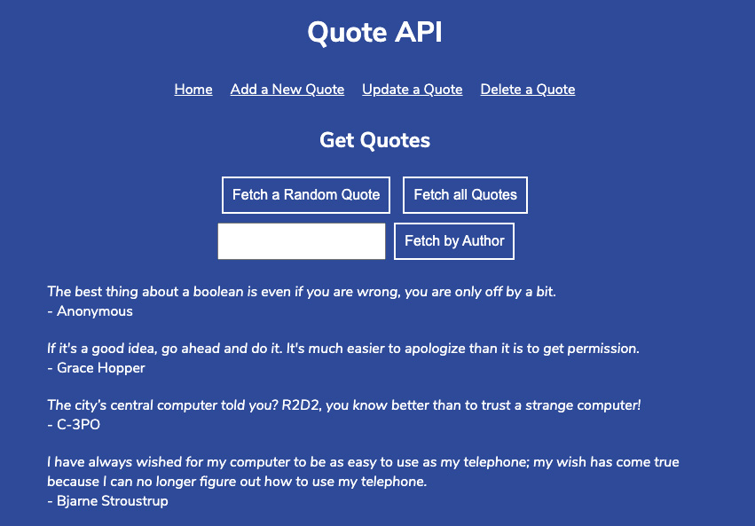

# Quote API
> Codecademy Challenge - Express JS server, routes. \
> Exercise covers the back-end of the project. Front-end by Codecademy.

## Table of contents
* [Screenshots](#screenshots)
* [Technologies](#technologies)
* [Features](#features)
* [Start](#start)

## Screenshots


## Technologies
* NodeJS
* ExpressJS
* JavaScript ES6

## Features
* Fetch a Random Quote
* Fetch all Quotes
* Fetch by Author
* Add a New Quote
* Update a quote (via URLs and Postman)
* Delete a quote (via URLs and Postman)

## Start
Start server in node:
```
node server.js
```
then visit **localhost:4001** in your browser.
